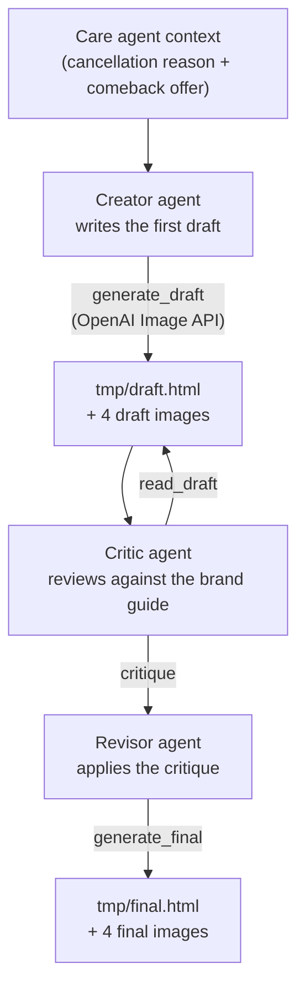

# Landing-page prototype (Customer Care reactivation)

A Google ADK prototype that turns a short Customer Care context — a former
customer's cancellation reason plus the comeback offer — into a personalised
Cooktop-branded reactivation landing page, critiques it against the brand guide,
then revises it.

## How it works

Three agents run in sequence:



The Creator writes warm, personalised copy and four image prompts (one hero,
three dish photos) and calls `generate_draft`, which renders the images and
`draft.html`. The Critic reads the draft and flags weaknesses in the CTA, brand
voice, and offer accuracy. The Revisor applies the critique and calls
`generate_final` to produce the revised page and images.

## Run it

Put your `OPENAI_API_KEY` in the `.env` file (gitignored), then run:

```bash
agents-cli run "Create a reactivation page for a former customer who cancelled because it was too expensive and wants the current comeback offer in writing."
```

Requires [uv](https://docs.astral.sh/uv/) and
[google-agents-cli](https://pypi.org/project/google-agents-cli/)
(`uv tool install google-agents-cli`). Install dependencies with
`agents-cli install`, and develop interactively with `agents-cli playground`.

The agents use `gpt-6-luna` through ADK `LiteLlm` and the OpenAI Image API
(`gpt-image-2.5-sunburst`).

## Project structure

```
landing-page/
├── app/
│   ├── agent.py    # Creator, Critic, Revisor (SequentialAgent)
│   └── tools.py    # generate_draft, read_draft, generate_final
├── docs/           # Brand guide used as the source of truth
├── tests/
└── tmp/            # Generated pages and images
```
